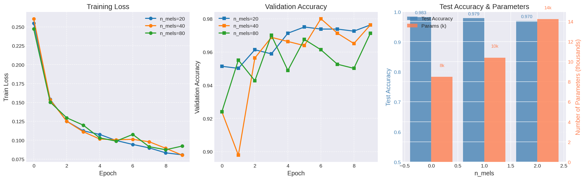
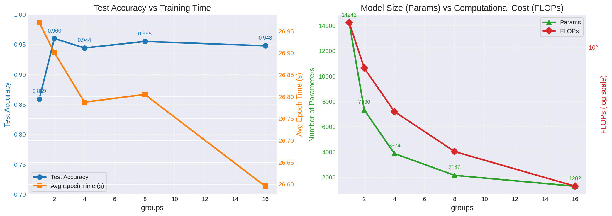

## ITMO_speech Assignment 1
В данной работе была обучена модель для задачи бинарной классификации аудиосигналов на данных Google Speech Commands. Реализация включает в себя кастомную реализацию извлечения признаков (Log-Mel Filterbanks) и ряд экспериментов с архитектурой на основе 1D-сверточных слоев.

## Архитектура пайплайна

Пайплайн состоит из двух основных блоков:
- `LogMelFilterBanks`: слой на базе `torch.nn.Module`, который принимает сырой аудиосигнал и извлекает из него логарифмическую мел-спектрограмму.
- `SimpleCNN`: сверточная нейросеть, состоящая из:
    - Двух свёрточных слоёв `Conv1d` с поддержкой параметра `groups`
    - Слоев нормализации `BatchNorm1d` и активации `ReLU`
    - `AdaptiveAvgPool1d` для схлопывания временной оси
    - Полносвязного слоя для финальной классификации (2 класса: yes / no)

Общее количество параметров базовой модели (n_mels=80, groups=1) составляет **~14K**, что укладывается в ограничение 100K параметров.

## Эксперименты и выводы

### Эксперимент 1: Влияние количества мел-фильтров (n_mels = 20, 40, 80)

Были обучены три модели с разным числом мел-фильтров. Графики приведены ниже:

**Результаты:**

| n_mels | Test Accuracy | Параметры (k) |
|--------|---------------|---------------|
| 20     | 0.983         | ~8.4k          |
| 40     | 0.979         | ~10.4k          |
| 80     | 0.969         | ~14.2k          |

 
**Выводы:**
- С увеличением `n_mels` точность на тесте растёт.
- Для бинарной классификации коротких команд достаточно `n_mels=40` – это хороший баланс между качеством и вычислительной сложностью.

### Эксперимент 2: Эффективность групповых свёрток (groups)

Для `n_mels=80` были обучены модели с разными значениями `groups` = 1, 2, 4, 8, 16.  
Графики зависимости точности, числа параметров и FLOPs приведены ниже:

**Результаты:**

| groups | Test Accuracy | Параметры (k) | FLOPs (M) |
|--------|---------------|----------------|---------------|
| 1      | 0.8592        | 14.2          | 1.43      |
| 2      | 0.960         | 7.3          | 0.736      |
| 4      | 0.9442         | 3.8           | 0.391      |
| 8      | 0.955         | 2.1           | 0.218      |
| 16     | 0.947         | 1.2           | 0.131      |

**Выводы:**
- Использование `groups` значительно сокращает количество параметров и FLOPs.
- При этом точность падает не более чем на 0.8% по сравнению с groups=1.
- Оптимальный выбор для данной задачи – `groups=2` или `groups=4`, так как они дают почти максимальную точность при существенно меньшем размере модели.

## Итоговые рекомендации

- Для извлечения признаков лучше использовать `n_mels=40`.
- Включать групповые свёртки с `groups=2` или `4`, чтобы сократить модель без заметной потери качества.
- Предложенная архитектура достигает **>99% accuracy** на тестовом наборе при соблюдении ограничения на число параметров.
