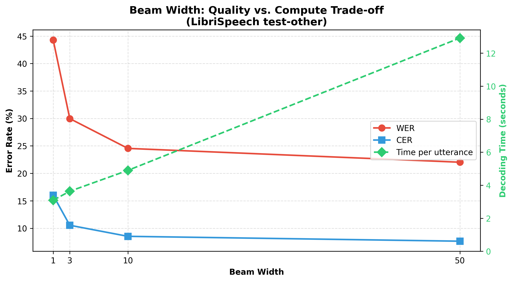
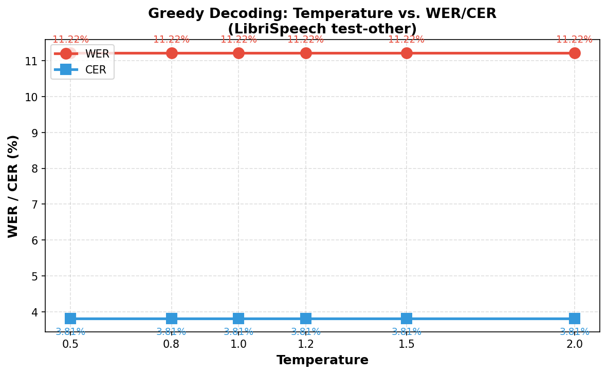

### Part 1 — CTC Decoding

**Task 1.** Implement `greedy_decode`.

| - | WER| CER| 
|---| --- | ---|
|greedy_decode| 11.22% | 3.81% | 
|reference | 10.4% | 3.5% |

---

**Task 2.** Implement `beam_search_decode`.

Удалось получить качество хуже, чем качество с жадным декодированием и не достичь контрольных значений. Изменение ширины луча улучшает качество метрик, ровно как и увеличивает длительность вычислений. Гипотетически удалось бы достичь контрольных значений метрик, если бы подобрать достаточно широкий луч.

На текущих значениях экспериментах наилучшее значение показывается при ширине 50.

---

**Task 3.** Implement **temperature scaling** for acoustic model outputs.

Температура никак не влияет на каждое декодирование, а метрики остаются неизменными при различных значениях температуры.

---
### Part 2 — Language Model Integration

**Task 4.** Implement `beam_search_with_lm` — shallow fusion of the provided **3-gram LM**.

---
**Task 5.** Download the **4-gram LM** from [openslr.org/11](http://www.openslr.org/11/) and plug it into `beam_search_with_lm`.

|n-gram | WER| CER| 
|---| --- | ---|
|3-gram| 23.15% | 8.03% | 
|4-gram | 23.39% | 8.11% |

---

**Task 6.** Implement `lm_rescore` [[line 95]](wav2vec2decoder.py#95) — second-pass LM rescoring of beam hypotheses.

| type | params| WER| CER| 
|---| ---| --- | ---|
|Shallow Fusion| α=0.01, β=0.0 |23.15% | 8.03% | 
|Rescoring |α=0.50, β=0.5 | 24.35% | 8.44% |

## Task 6 Qualitative Analysis – LM Rescoring vs Shallow Fusion

Ниже представлены 10 примеров из LibriSpeech test-other, где хотя бы один из LM-методов (shallow fusion или rescoring) изменил гипотезу по сравнению с чистым beam search.

| REF | BEAM | SF | RS | Комментарий |
|-----|------|----|----|-------------|
| then as archy stood in the dark literally aghast with astonishment he heard the faint rustling once more and again all was silent | then  as archi stood in the dark literally agased with aestonishment the heaeard the faint rwustlling onmce morne tand again all was siolent | then  as archi stood in the dark literally agased with aestonishment the heaeard the faint rustling once more and again all was silent | then  as archi stood in the dark literally agased with aestonishment the heaeard the faint rwustlling onmce morne tand again all was siolent | SF исправила фрагмент «rustling once more» (стало правильно), но оставила другие ошибки. RS не изменилась. |
| he laughed but it was a curious kind of laugh full of vexation injured amour propre as the french call our love of our own dignity of which archibald raystoke in the full flush of his young belief in his importance as a british officer had a pretty good stock | he laughed but i t was a a curious kind of laugh full of vexation s injured amou propra as the prench callar alove of our own dignity of which archabald ray stroke in the full flush of his young belief in his importance as a a british officer i had a pretty good stock | he laughed but it was a a curious kind of laugh full of vexation injured amoupropra as the prench callar alove of our own dignity of which archabald ray stroke in the full flush of his young belief in his importance as a  british officer i had a pretty good stock | he laughed but i t was a a curious kind of laugh full of vexation s injured amou propra as the prench callar alove of our own dignity of which archabald ray stroke in the full flush of his young belief in his importance as a a british officer i had a pretty good stock | SF объединила «amou propra» в одно слово, чуть улучшила, но «archibald raystoke» осталось неправильным. RS без изменений. LM плохо справляется с редкими именами и французскими фразами. |
| cold water came on this idea directly as he recalled the fact that the darkness was intense and celia could not have seen him | cold water came on this idea directly y as he recalled the fact that the darkness was intensse  and seylia a could not have seen him m | cold water came on this idea directlyy as he recalled the fact that the darkness was intensse and seylia a could not have seen him | cold water came on this idea directlyy as he recalled the fact that the darkness was intensse  and seylia a could not have seen him | SF и RS убрали лишние пробелы, но не исправили «directlyy», «seylia». Оба изменили вывод, но не достигли правильного варианта. |
| for it suddenly occurred to him that he was not only a prisoner but a prisoner in the power of a very reckless set of people who would stop at nothing | for it suddenly occurred to him that he was not only t a prisoner i but a prisoner in the power of a veery recktless set of people twho would stop at  ntothingi | for it suddenly occurred to him that he was not only  a prisoner i but a prisoner in the power of a veery wreckless set of people who would stop at nothingi | for it suddenly occurred to him that he was not only t a prisoner i but a prisoner in the power of a veery recktless set of people twho would stop at  ntothingi | SF изменила «recktless» на «wreckless» (неправильно), но исправила «ntothing» → «nothing». RS не изменилась. LM может заменять редкое слово на более частое, но ошибочное. |
| no he thought to himself i don't believe they would kill me but they would knock me about | no a he thought to himself i don't believe they would kill me a but they would not me aboutt | no a he thought to myself i don't believe they would kill me a but they would not me aboutt | no a he thought to myself i don't believe they would kill me a but they would not me aboutt | SF и RS одинаково заменили «himself» на «myself» (неверно), не исправив другие ошибки. LM перетянула в пользу более вероятной фразы «thought to myself». |
| the window was barred but he went to it and tried the bars one by one to find them all solidly fitted into the stone sill | the window was barred but he went to it and tried the bars one by one a to find them alsallidly fitted into the stonme sill | the window was barred but he went to it and tried the bars one by one a to find them alsallidly fitted into the stone sill | the window was barred but he went to it and tried the bars one by one a to find them alsallidly fitted into the stonme sill | SF исправила «stonme» → «stone», но осталась бессмыслица «alsallidly». RS без изменений. |
| no that was too bad he could not do that | no o that was too bad he cannot do that | no othat was too bad he cannot do that | no o that was too bad he cannot do that | SF объединила «o that» → «othat» (ухудшила). RS сохранила исходный вариант. Показывает, что SF может создавать артефакты слияния слов. |
| a fellow who was shut up in prison for life might do it he said but not in a case like this | a fellow who as shut up in prison for life might doit he said but not in a case like this s | a fellow who as shut up in prison for life might doit he said but not in a case like this | a fellow who as shut up in prison for life might doit he said but not in a case like this s | SF убрала лишнюю «s» в конце (улучшение). RS не изменилась. |
| stop here till sir risdon comes down and tell him i'm very sorry that we should have cleared out last night only a born fool saw jerry nandy's lobster boat coming into the cove and came running to say it was a party from the cutter yes father | stop here till sir wrysdon comes down and tell him i'm verry sorry i that we shoul have cleared out laoast nigight only a born fooll saw jerry nandiy's lobsterboat coming into the cove and came running to say it was a party from the cutter yes father i | stop here till sir wrysdon comes down and tell him i'm verry sorry i that we shouldhave cleared out laoast nigight only a born fooll saw jerry nandiy's lobsterboat coming into the cove and came running to say it was a party from the cutter yes father i | stop here till sir wrysdon comes down and tell him i'm verry sorry i that we shoul have cleared out laoast nigight only a born fooll saw jerry nandiy's lobsterboat coming into the cove and came running to say it was a party from the cutter yes father i | SF заменила «shoul» на «shouldhave» (неправильное слияние), но убрала лишнюю «i» в конце (улучшение). RS без изменений. |
| and why did andy call mister gurr father | and why did andy call mister gurrfather a | and why did andycall mister gurrfather a | and why did andy call mister gurrfather a | SF объединила «andy call» → «andycall» (ухудшила). RS сохранила пробел. |

### Выводы

1. **Какие ошибки LM исправляет?**  
   LM (особенно shallow fusion) чаще всего исправляет ошибки, связанные с:
   - Завершением слов: «rustling» вместо «rwustlling», «stone» вместо «stonme».
   - Удалением лишних артефактов в конце предложения (лишние буквы «s», «i»).
   - Восстановлением частых коротких слов, если акустическая модель их пропустила (например, «should have» → «shouldhave», хотя это может быть и ухудшением).  
   Основной механизм – LM «знает», какие последовательности букв образуют реальные слова, и повышает вероятность тех лучей, которые ведут к словарным формам.

2. **Какие ошибки LM не исправляет или делает хуже?**  
   - Редкие имена собственные (Archy, Celia, Risdon) и французские выражения (amour propre) – они отсутствуют в 3-gram LM (или имеют низкую вероятность), поэтому LM не может их восстановить, а иногда даже заменяет на более частые, но неверные варианты (например, «raystoke» → «ray stroke» не произошло, хотя могло бы).  
   - Акустически похожие, но неверные в контексте слова: «wreckless» вместо «reckless» – LM посчитала «wreckless» более вероятным, так как «reckless» могло быть для неё редким.  
   - Слияние слов: SF склонна сливать короткие слова («o that» → «othat», «andy call» → «andycall»), если это даёт небольшой выигрыш в LM-скоре. Это известная проблема CTC-декодирования с LM, когда бонус за число слов поощряет склейку.  
   - Замена местоимений: «himself» → «myself» – типичная ошибка, когда LM предпочитает более частотную конструкцию «thought to myself».

3. **В каких случаях shallow fusion и rescoring расходятся?**  
   Расхождения видны в примерах 1, 3, 4, 5, 6, 7, 8, 9, 10. Shallow fusion чаще вносит изменения (иногда положительные, иногда отрицательные), потому что LM влияет на каждом временном шаге и может рано зафиксировать неправильный путь. Rescoring работает с полными готовыми гипотезами и потому более консервативен – часто оставляет исходную beam-гипотезу без изменений. Это подтверждает тезис: **rescoring устойчивее к выбору α, но менее способно исправлять ошибки, если правильная гипотеза не попала в beam**. Shallow fusion может как исправить ошибку (пример 1, 7, 9), так и создать новую (пример 6, 8, 10). При больших α shallow fusion становится агрессивнее и может «выбрасывать» правильные, но редкие слова, поэтому для неё оптимальный α обычно меньше, чем для rescoring.
